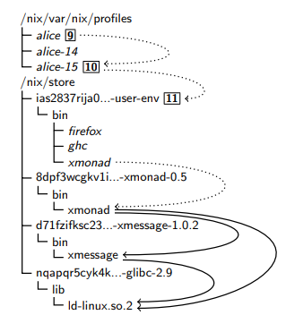

# Analogia: _hashmap_ vs árvore

Em estrutura de dados se estuda formas de guardar os dados na memória a fim de poder recupera-los de forma mais rápida. Não vou aprofundar tanto nesse assunto em específico mas só o que é pertinente nesse caso.

## O que é uma _hashmap_/_hashtable_/tabela hash?

Se você já programou Python você conhece pelo nome de dicionário, a ideia é basicamente a mesma.

É uma estrutura de dados em que o programador pode associar um valor a uma chave e depois pode recuperar este mesmo valor partindo dessa chave.

## O que é uma árvore?

É uma estrutura de dados hierárquica, ou seja, tem um ponto mais álto, que se divide entre n caminhos. É composta por nós e arestas. O nó mais alto é o nó raiz e nó que não tem filhos é chamado de nó folha. Existem vários tipos de árvores, o mais conhecido é a árvore binária em que cada nó tem até dois nós filhos. Para a nossa analogia assuma que um nó pode ter quantos filhos forem necessários.

## O que isso tem a ver com Nix?

Como gerenciadores de pacotes tradicionais gerenciam pacotes? Mais especificamente, como eles aplicam atualizações?

Eu, @lucasew, ja usei Arch Linux por aproximandamente um ano e naquele tempo eu usava um setup com i3wm + [polybar](https://aur.archlinux.org/packages/polybar/). A questão é que o polybar depende de uma biblioteca chamada [jsoncpp](https://archlinux.org/packages/extra/x86_64/jsoncpp/) e vivia quebrando por causa desta bibiliteca. Por que?

A cada atualização de pacote essa biblioteca virava um arquivo diferente e, consequentemente, quando o polybar atualizava mudava o nome do arquivo que ele buscava para encontrar essa biblioteca. Toda atualização mensal dava alguma quebra e o polybar simplesmente se recusava de abrir e é aí que reside a analogia do _hashmap_.

Quando um pacote é atualizado pelo pacman a versão nova é sobrescrita em cima da antiga e qualquer coisa que assuma algum detalhe de uma versão em específico vai quebrar, e esse é o perigo da mutabilidade.

O Nix não tem esse problema.

Ao invés do pacote polybar depender do jsoncpp é uma _derivation_ que compila o polybar que depende da _derivation_ que compila o jsoncpp,  se o jsoncpp atualizar isso consequentemente vai alterar a _derivation_ do polybar por consequência.

