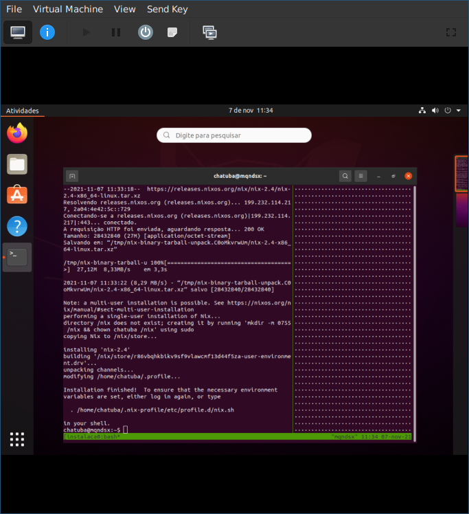
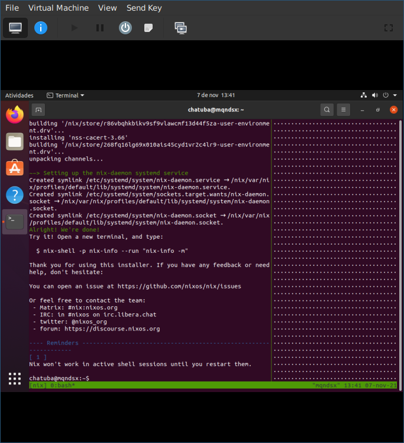

# Comandos para instalação

Os comandos aqui apresentados foram testados em uma distribuição Ubuntu 20.04.3 LTS executando como uma VM do Virt Manager.

O autor já conseguiu instalar com sucesso no Linux Mint Mate 20 e em uma instalação de 2017 do Debian 9.

Apenas o Debian 9 possui ressalvas pois não estava atualizado o que fazia este apresentar erros de certificado SSL, que podem ser ignorados passando o parâmetro `-k` no comando curl.

Relembrando: **Não execute os seguintes comandos logado como usuário root**

FUN FACT: Para as demonstrações em imagem foram instalados apenas o curl, o openssh-server e o tmux em uma instalação Ubuntu recém feita. Entre estas dependências apenas o curl é obrigatório pois o virt-manager por padrão não faz integração de área de transferência então foi-se usado uma sessão tmux e ssh para poder colar em um terminal fora da VM.

## Instalação single user

```sh
curl -L https://nixos.org/nix/install | sh
```




## Instalação multiuser


```sh
curl -L https://nixos.org/nix/install | bash -s -- --daemon
```



## Considerações extra

O instalador vai fornecer bastante informação do que está acontecendo e se você baixar o script e chamar com o bash depois de baixado ele até vai pedir algumas confirmações. Você pode usar isso ao seu favor e de repente encontrar algum tópico que nunca viu na vida para pesquisar.
